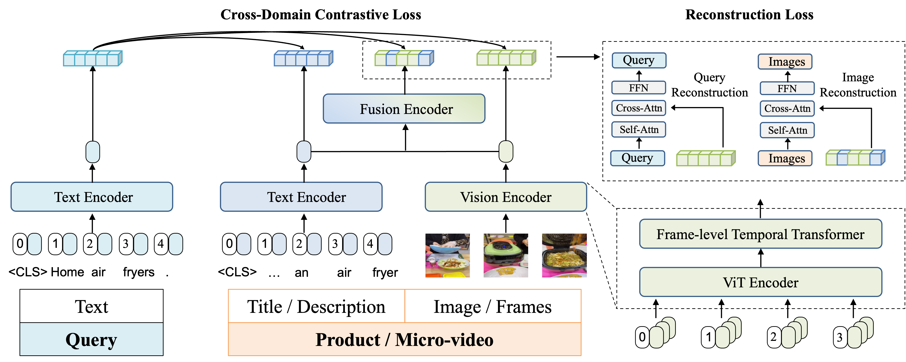

# **Real20M: A Large-scale E-commerce Dataset for Cross-domain Retrieval**

This is the source code of our ACM MM 2023 paper "[Real20M: A Large-scale E-commerce Dataset for Cross-domain Retrieval](https://hexiangteng.github.io/papers/ACM%20MM%202023%20Real20M.pdf)".



## Installation

```bash
conda env create -f environment.yml
source activate Real
```

## Dataset


We release the entire section of the Real400K dataset and conducted experimental comparisons for [our paper](https://hexiangteng.github.io/papers/ACM%20MM%202023%20Real20M.pdf) on this dataset. To facilitate downloading of this dataset in China, we provide a **Baidu Netdisk download link**. Please note:

1. Regarding dataset download, please sign the [Release Agreement](Release_Agreement.pdf) and send it to [Yanzhe Chen](chenyanzhe@stu.pku.edu.cn). By sending the application, you are agreeing and acknowledging that you have read and understand the [notice](notice.pdf). We will reply with the file and the corresponding guidelines right after we receive your request!

2. The dataset is large in scale and requires approximately **136G** of storage consumption.

3. The organization format of this dataset is as follows, please pay attention to the correspondence between goods images, video frames, and their related text.

   ```unicode
   Dataset/
   ├─ Real400K/
   │  ├─ query/
   │  ├─ goods/
   │  │  ├─ images
   │  │  ├─ text
   │  ├─ video/
   │  │  ├─ images
   │  │  ├─ text
   ├─ train_file/
   ├─ test_file/
   ├─ checkpoints/
   ```

## Quick Start

The training code is built on PyTorch with DistributedDataParallel (DDP). We pretrain the framework on 2 nodes, each with 8 V100 GPUs (10 epochs in about two days).

The evaluation code, consisting of a series of scripts, is designed to ensure rapid retrieval of massive samples, taking approximately 20 minutes to run on a V100.

Please note to **complete the path** at the beginning of the following script files.

```bash
# Train the query-guided cross-domain retrieval framework.
sh train.sh

# Evaluate on the Video2goods task.
sh video2goods_evaluate.sh

# Evaluate on the Goods2video task.
sh goods2video_evaluate.sh
```

## Model Wights

Due to the restriction imposed by Kuaishou on code sharing, which prevents us from making the pre-training framework code public.

However, we will open-source the model weights and provide a link to access them in the **Baidu Netdisk download link**.

Please download and put the checkpoints under: `outputs/checkpoints/`, `pretrain.pth.tar` is the pre-trained model, while `checkpoint.pth.tar` is the model that achieves the SOTA results.

## Citation

If you find our work helps, please cite our paper.

```bibtex
@inproceedings{chen2023real20m,
  title={Real20M: A large-scale e-commerce dataset for cross-domain retrieval},
  author={Chen, Yanzhe and Zhong, Huasong and He, Xiangteng and Peng, Yuxin and Cheng, Lele},
  booktitle={Proceedings of the 31st ACM International Conference on Multimedia},
  pages={4939--4948},
  year={2023}
}
```

## Contact

This repo is maintained by [Yanzhe Chen](https://github.com/ChenAnno). Questions and discussions are welcome via `chenyanzhe@stu.pku.edu.cn`.

## Acknowledgements

Our code references the following projects. Many thanks to the authors.

- [ALBEF](https://github.com/salesforce/ALBEF)
- [X-CLIP](https://github.com/microsoft/VideoX/tree/master/X-CLIP)
